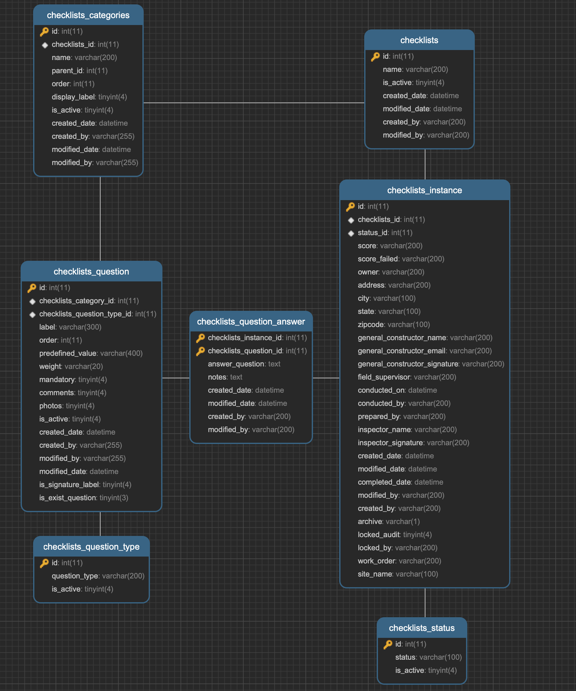
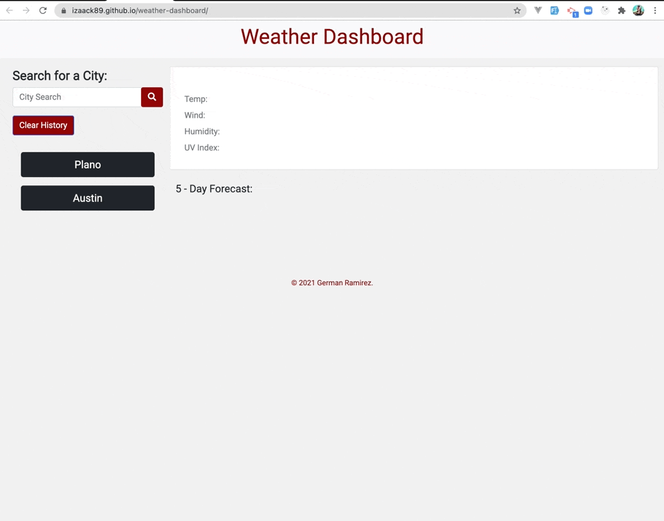
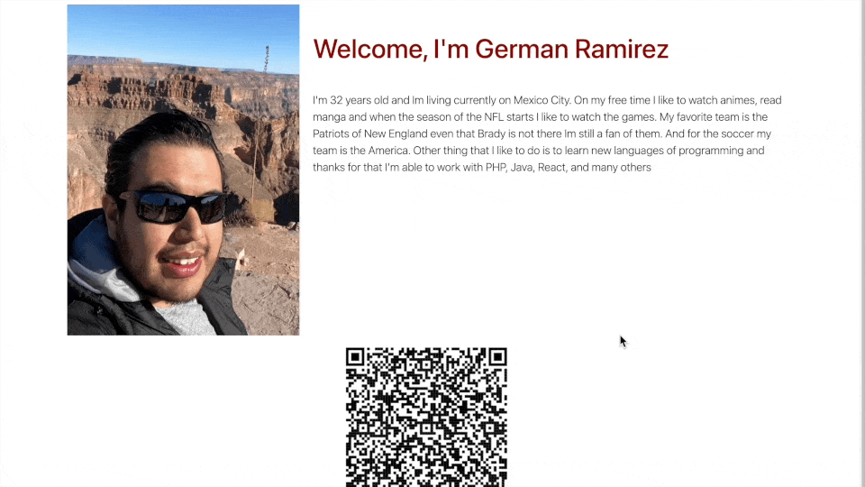

# Hi, I'm German Ramirez

Full Stack developer with 12+ years of experience that has operated on the execution of websites and software platforms that have consolidated improvements on the process of the clients. Earned a certificate in Full Stack Web Development from the Instituto Tecnologico de Monterrey Coding Boot Camp. Innovative and problem-solver who is passionate about developing apps and websites with a focus on client needs first.

## Skills and Experience

- `Languages:` JavaScript ES6+, CSS3, HTML5, SQL, NoSQL, PHP, Java, .NET
- `Applications:` GitHub, MongoDB, MySQL, PostgreSql, Oracle, GITLAB, CVS, SVN, Bitbucket, Tableau 
- `Tools:` Express, React, Node, Handlebars, Query, Bootstrap, Apollo Server, JWT, GraphQL, Bootstrap, Materialize, Redux, Context, Bootstrap-React, Styled-Component, Mongoose, API’s, AJAX, Font Awesome, React Icons, Jquery, Symphony 2, Laravel  
- `Others:` Windows, Linux, AWS, Heroku, Tableau Server,  Jest, Selenium Laravel, Selenium Plugin  

## Work Examples

- **PHP**

  - #### PropAnalysis System

- #### Tempus Portal System

On this programming language I have created full systems such as this example that is a "Property Analysis System" where the agent can enter an do an analysis of a property in order to have an idea about REHAB , OFFER , MAX OFFER , RENT/SALES COMPS. On the system "Tempus" is a portal for Investors where they aply to a Fund and the Fund Admin can obtain all the information necessary and notice the Investor if is approved or not.Using AJAX for Async data connection , API call to Docusign or Signow for documents sign and Mysql as main Database. Both Systems are protected with login system

- #### Ajax Backend Script
  
- #### PDF Export FPDF export
  

Also I have created script on PHP for print PDF, Excel , Word document that obtain the information from the DB. Another type of scripts are the ones that use API or SDK to connect with external system and retrieve data from them. Some API are I have been working are Zillow, Routetify, Quickbooks, Clio, Google, Facebook, among others

- **MYSQl**

Here I can show one of many schemas that I have creted on the past , with this I want to show that I know how to create relations between tables and also I can built for robust systems such as this example that represent a system for audits

## Repositorie Examples

[Pata de Perro Repo](https://github.com/adina-hc/pata-de-perro) |
[Pata de Perro  Live](https://shrouded-bayou-22662.herokuapp.com/) 
- 

___
[School System Repo](https://github.com/izaack89/school-system) |
[School System Live](https://infinite-chamber-84516.herokuapp.com/)
--

___
[Sport Almanac Repo](https://github.com/adina-hc/sports-almanac) |
[Sport Almanac Live](https://adina-hc.github.io/sports-almanac/)  

___
[Code BaseRepo](https://github.com/izaack89/code-base) |
[Code Base Live](https://izaack89.github.io/code-base/)

___
[Day Planner Repo](https://github.com/izaack89/day-planner) |
[Day Planner Live](https://izaack89.github.io/day-planner/)

___
[Weather Dashboard Repo](https://github.com/izaack89/weather-dashboard) |
[Weather Dashboard Live](https://izaack89.github.io/weather-dashboard/)

___
[Tech Blog Repo](https://github.com/izaack89/tech-blog) |
[Tech Blog Live](https://floating-garden-59968.herokuapp.com/login)

## Portfolio Built With

- [Favico Generator](https://www.favicon-generator.org/) - Roboto font
- [SVG Images](https://undraw.co/search) - SVG Images
- [React Icons](https://react-icons.github.io/react-icons/) - React Icons
- React
- Styled-Component

## [Portfolio GitHub Code](https://github.com/izaack89/german-portfolio/)

## [Portfolio Live](https://izaack89.github.io/german-portfolio/)

## Author

- **German Ramirez** - [GitHub](https://github.com/izaack89/)
- **German Ramirez CV** - [CV](https://rcconsultingmx.com/bootcamp/career_service/CV-German_I_Ramirez_Castanon.pdf)

